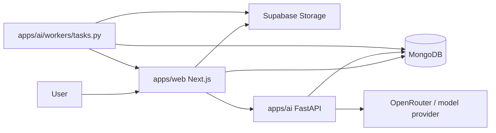

# MediLocker V2

Patient-controlled, AI-assisted health vault for uploading, organizing, and interpreting medical records.

This repository is a monorepo with:
- A Next.js App Router web app in `apps/web`
- A FastAPI AI service in `apps/ai`
- Shared MongoDB schemas, auth helpers, and infra code in `packages/*`

The `docs/` folder is currently empty in this workspace, so this README is the best up-to-date overview of what is implemented right now.

---

## What Is Implemented Right Now

- Authentication and role-aware UI in the web app, with `/` redirecting to `/home`.
- Patient and dependent profiles backed by MongoDB.
- A document vault for uploads, metadata, versioning, soft delete, restore, and purge flows.
- AI-assisted extraction, classification, structured summaries, health summaries, vitals analysis, trend analysis, recommendations, explainability, and title generation.
- Background processing through a lightweight polling worker that reads jobs from the app and posts results back.
- Emergency, claims, doctor, admin, appointment, family, and hospital routes are present in the web app, with varying levels of completion.

## How The System Fits Together



The practical flow is:
1. A user signs in and uploads a medical document in `apps/web`.
2. The web app stores the file in Supabase and metadata in MongoDB.
3. The web app calls the AI service for extraction, classification, or summarization.
4. Background jobs are picked up by the polling worker when heavier processing is needed.
5. Results are written back into MongoDB and shown in the UI.

---

## Main App Surface

### `apps/web`
- Next.js app using the App Router.
- Main routes include `home`, `documents`, `profile`, `dashboard`, `doctor`, `admin`, `emergency`, `appointments`, `family`, and `hospitals`.
- API routes live under `app/api/*` for documents, OCR, jobs, sharing, profiles, alerts, vitals, claims, emergency access, and related flows.
- Core helpers live in `lib/` and `services/` for auth, MongoDB, Supabase storage, and AI calls.

### `apps/ai`
- FastAPI service defined in `main.py`.
- Routers currently include `classify`, `summarize`, `trends`, `recommend`, `explain`, `extract`, `vitals`, `health_summary`, `openrouter`, and `generate_title`.
- Pipelines in `pipelines/` implement the AI workflows.
- `workers/tasks.py` is a polling worker, not a Celery worker.

### `packages/db`
- Shared MongoDB collection schemas and indexes.
- Key collections include `users`, `profiles`, `documents`, `documentVersions`, `classification`, `ocrOutputs`, `summaries`, `jobs`, `shares`, `alerts`, `sessions`, `audits`, `adminEvents`, `claims`, `trends`, `insights`, `timeline`, `healthScores`, `userVitals`, `userHealthSummary`, and the emergency token/audit collections.

### `packages/auth`
- Shared JWT, OAuth, RBAC, refresh rotation, and session revocation helpers.
- The user-facing auth flow is implemented in `apps/web` with NextAuth.

## What Is Complete vs. Scaffolded

Working today:
- Sign-in and role-aware navigation.
- Document upload, extraction, and summary generation.
- MongoDB-backed profiles, documents, summaries, jobs, alerts, and emergency collections.
- FastAPI routes for extraction, classification, summarization, trends, recommendations, vitals, health summary, and title generation.

Partially scaffolded or still evolving:
- Deeper doctor and admin workflows.
- Claims and advanced insights UX.
- End-to-end background processing polish.
- Broader documentation under `docs/`, which is currently empty in this workspace.

---

## Running Locally

### Prerequisites
- Node.js LTS
- npm
- Python 3.10+
- MongoDB
- Supabase Storage
- Google OAuth credentials for NextAuth
- An internal auth token shared between the web app and AI service

### Install Dependencies

From the repo root:

```bash
npm install
```

Then install the Python dependencies for the AI service:

```bash
cd apps/ai
pip install -r requirements.txt
```

### Start the Web App

From the repo root:

```bash
npm run web:dev
```

Or run the app directly from `apps/web`:

```bash
cd apps/web
npm run dev
```

### Start the AI Service

From `apps/ai`:

```bash
uvicorn main:app --reload
```

### Start the Polling Worker

From `apps/ai`:

```bash
python workers/tasks.py
```

---

## Deploying to Render

`render.yaml` defines three services:
- Web: Next.js app in `apps/web`
- AI: FastAPI service in `apps/ai`
- Worker: polling worker in `apps/ai/workers/tasks.py`

The important environment variables are:
- `MONGODB_URI` and `MONGODB_DB`
- `SUPABASE_URL`, `SUPABASE_SERVICE_ROLE_KEY` for web, and `SUPABASE_SERVICE_KEY` for AI/worker
- `NEXTAUTH_URL`, `NEXTAUTH_SECRET`, `GOOGLE_CLIENT_ID`, `GOOGLE_CLIENT_SECRET`
- `AI_BASE_URL`
- `INTERNAL_AUTH_TOKEN`
- `OPENROUTER_API_KEY` if you use the OpenRouter-backed routes

---

## Development Notes

- The code under `apps/` and `packages/` is the source of truth.
- If you add or rename collections, update the matching files in `packages/db`.
- If you change API surfaces, update the corresponding route handlers in `apps/web/app/api` or `apps/ai/routers`.

## Status Summary

- ✅ Next.js web app with document vault and role-aware navigation
- ✅ FastAPI AI service with extraction, classification, summarization, health summary, and trend endpoints
- ✅ MongoDB schema layer with jobs, summaries, claims, emergency, and health data collections
- ✅ Supabase-backed storage integration
- 🟡 Some dashboards and advanced workflows are still scaffolded or partially implemented

This README now reflects the current workspace rather than the older V2 spec draft.

